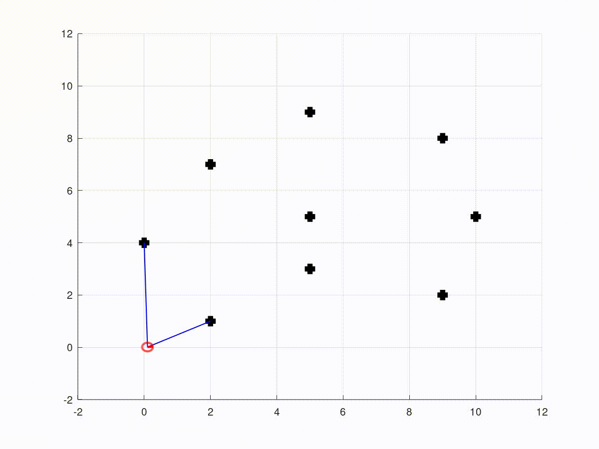
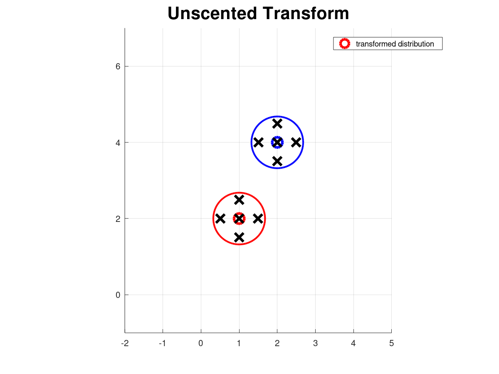
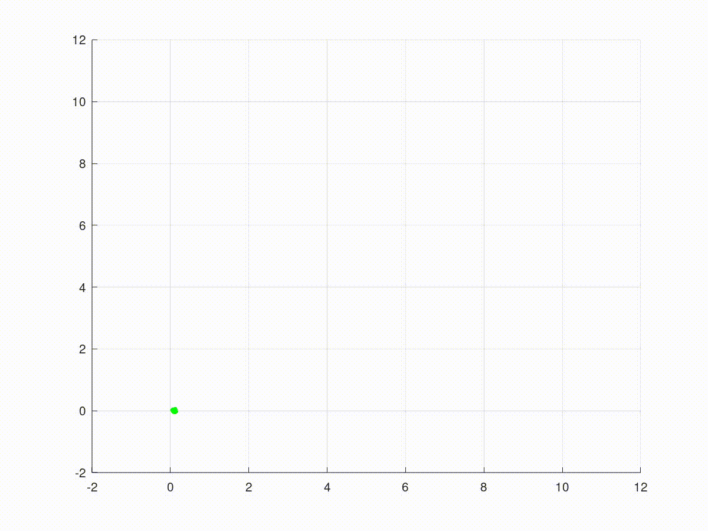
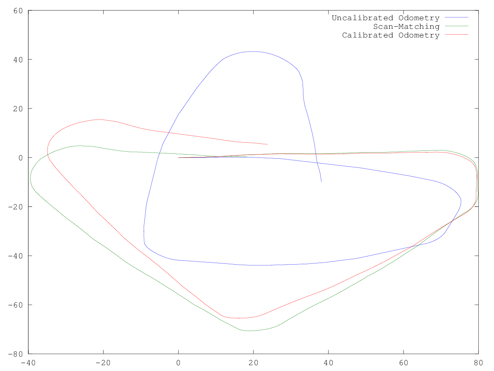
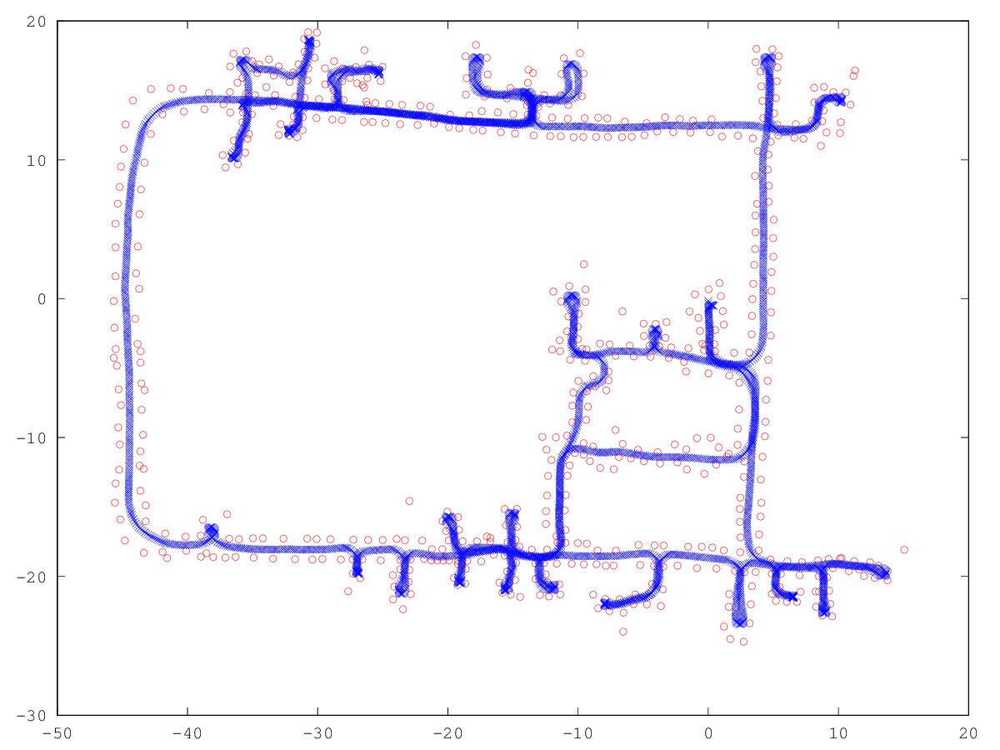

# SLAM-Course-Solutions 
This repository contains the full solutions to the assignments of the SLAM Robot Mapping course WS 2013/14 by [Dr. Cyrill Stachniss](http://www.informatik.uni-freiburg.de/~stachnis) - University of Freiburg, Germany.

Folders are prefixed with the sheet number, as found on the course page.   
Sheets 2 and 3 were written assignments and so I did not complete these assignments.   
The `/playground` folder contains other tutorials I have completed on the Computer Vision/SLAM topic.

**Course page, lecture matterials & assigments:**  http://ais.informatik.uni-freiburg.de/teaching/ws13/mapping/index_en.php  **-**  [MIRROR](https://web.archive.org/web/20191216041354/http://ais.informatik.uni-freiburg.de/teaching/ws13/mapping/index_en.php)   
**Course YouTube playlist:** https://www.youtube.com/playlist?list=PLgnQpQtFTOGQrZ4O5QzbIHgl3b1JHimN_

## What is SLAM?
> Simultaneous Localization and Mapping (SLAM) is the computational problem of constructing or updating a map of an unknown environment while simultaneously keeping track of an agent's location within it.   

######  *Simultaneous localization and mapping*, Wikipedia foundation, 2020, [website](https://en.wikipedia.org/wiki/Simultaneous_localization_and_mapping)

#### Theory
The mathematics behind the heart of SLAM algorithms include probability theory, Bayesian and Markov methods. Depending on the specifics of the SLAM algorithm, knowledge of several other techniques may also be required - for example, the GraphSLAM (or LeastSquares SLAM) requires knowledge of graph theory.   
   
   
## About the course
Robot Mapping by Dr. Cyrill Stachniss gives an overview of the SLAM problem. It gives an in-depth overview of the algorithms in sufficient detail to learn how to implement them yourself.

#### Course overview
>The problem of learning maps is an important problem in mobile robotics. Models of the environment are needed for a series of applications such as transportation, cleaning, rescue, and various other service robotic tasks. Learning maps requires solutions to two tasks, mapping and localization. Mapping is the problem of integrating the information gathered with the robot's sensors into a given representation. It can intuitively be described by the question ''What does the world look like?'' Central aspects in mapping are the representation of the environment and the interpretation of sensor data. In contrast to this, localization is the problem of estimating the pose of the robot relative to a map. In other words, the robot has to answer the question ``Where am I?'' These two tasks cannot be solved independently of each other. Solving both problems jointly is often referred to as the simultaneous localization and mapping (SLAM) problem. There are several variants of the SLAM problem including passive and active approaches, topological and metric SLAM, feature-based vs. volumetric approaches, and many others.   

>The lecture will cover different topics and techniques in the context of environment modeling with mobile robots. We will cover techniques such as SLAM with the family of Kalman filters, information filters, particle filters. We will furthermore investigate graph-based approaches, least-squares error minimization, techniques for place recognition and appearance-based mapping, and data association. The exercises and homework assignments will also cover practical hands-on experience with mapping techniques, as basic implementations will be part of the homework assignments.

######  *Robot Mapping - WS 2013/14 Course Page*, "What is this lecture about?", Cyrill Stachniss, 2014, [website](http://ais.informatik.uni-freiburg.de/teaching/ws13/mapping/index_en.php)

## Software
Solutions created & tested in `Octave 5.2.0` on `Windows 10`.       

The code should also be compatible with MATLAB. However, this has not been tested.   

More about conversion and differences between Octave & MATLAB can be found [here](https://en.wikibooks.org/wiki/MATLAB_Programming/Differences_between_Octave_and_MATLAB).

## Results / plots
The video/plot result(s) can be found within `/plots` in each assignment folder.

| Assignment                   | Animation/Image                                                              | 
| ---------------------------- | ---------------------------------------------------------------------------- | 
| **1** - Octave Tutorial      |                         | 
| **4** - EKF SLAM             |                                        | 
| **5** - Unscented Transform  |                      | 
| **6** - UKF SLAM             |                                        | 
| **7, ex1** - Grid Mapping    |                                       | 
| **7, ex2** - Particle Filter |                       | 
| **8** - FAST SLAM            |                                | 
| **9** - Odom Calibration     |  | 
| **10** - Graph Based SLAM    |                   | 

## Other Solutions
Below are other repositories with similar solutions to the course assignments.   
As Cyrill Stachniss has not published the solutions, I found them quite helpful to refer to for help and for checking my own solutions.
 -  [kiran-mohan](https://github.com/kiran-mohan) / **[SLAM-Algorithms-Octave](https://github.com/kiran-mohan/SLAM-Algorithms-Octave)**
 -  [salihmarangoz](https://github.com/salihmarangoz) / **[RobotMappingCourse](https://github.com/salihmarangoz/RobotMappingCourse)**
 -  [aimas-upb](https://github.com/aimas-upb) / **[slam-course-solutions](https://github.com/aimas-upb/slam-course-solutions)**
